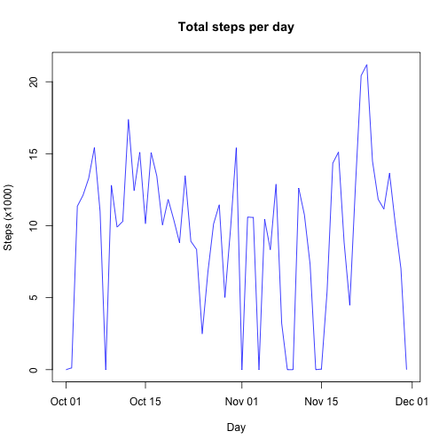
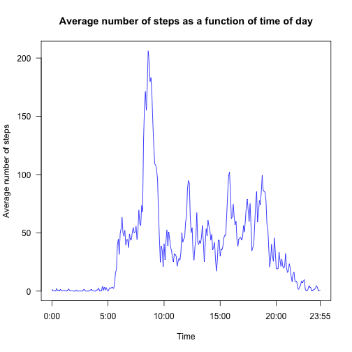

The below analysis is done on a dataset that records with 5 minute intervals the number of steps taken by an anonymous volunteer during a two month period. The below document shows all R commands required for the analysis. 

To reproduce this analysis, the dataset (activity.txt) should be in the current working directory. The analysis also makes use of the `plyr` R-package. 


```r
library(plyr)
knitr::opts_chunk$set(fig.path='figure/')  # store figures in the /figure directory
```

## 1. Loading and preprocessing the data
The below commands load the data set and shows the structure of the raw data.


```r
df <- read.table('activity.csv', header = TRUE, sep = ",")
head(df)
```

```
##   steps       date interval
## 1    NA 2012-10-01        0
## 2    NA 2012-10-01        5
## 3    NA 2012-10-01       10
## 4    NA 2012-10-01       15
## 5    NA 2012-10-01       20
## 6    NA 2012-10-01       25
```

```r
str(df)
```

```
## 'data.frame':	17568 obs. of  3 variables:
##  $ steps   : int  NA NA NA NA NA NA NA NA NA NA ...
##  $ date    : Factor w/ 61 levels "2012-10-01","2012-10-02",..: 1 1 1 1 1 1 1 1 1 1 ...
##  $ interval: int  0 5 10 15 20 25 30 35 40 45 ...
```

There are three columns: the `date` column refers to the date of each measurement. The `interval` column indicates the time interval of the measurement. The sampling rate is 5 min, so that `interval`=0 represents midnight 0:00, and interval values 100, 200, 1405, etc. represent times 1:00, 2:00, 14:05 etc. The `steps` column records the number of steps taken during a specific 5 minute interval: these are integers, or `NA`.

The below code transforms the `date` column from using factor variables into R date-objects, and verifies that the measurements only contain data from the 1st of October 1st to the last of November, 2012. 


```r
df$date <- as.Date(as.character(df$date))
c(min(df$date), max(df$date))
```

```
## [1] "2012-10-01" "2012-11-30"
```

## 2. What is the mean total number of steps taken per day?
The `steps` column  contains missing values (encoded as NAs). In the first analysis of the data, these are excluded from the analysis. With this treatment of NAs, the below plot shows the total number of steps per day during the two months:


```r
collect_steps <- function(x) {
    # sum values in the 'steps' column
    # over rows where 'date' are the same.
    res <- sum(x[ , "steps"], na.rm = TRUE)
    # store result in a 'tot_steps' column
    data.frame(tot_steps = res)
    }
df_daily_steps <- ddply(df, .(date), collect_steps)
plot(df_daily_steps$date, df_daily_steps$tot_steps / 1000, 
     xlab = "Day",
     ylab = "Steps (x1000)",
     col  = 'blue',
     main = "Total steps per day",
     type = 'l')
```

 

The below histogram shows the frequency of different total steps/day during the two month period. The peak at the left indicates that there are 10 days that measured zero total steps, and/or for which there is no data. 


```r
hist(df_daily_steps$tot_steps / 1000, 
     breaks = 20, 
     main= "Histogram of total steps per day",
     xlab = "Steps per day (x1000)",
     col = "green")
```

 

The mean and median of the total number of steps/day are given as follows:


```r
summary(df_daily_steps$tot_steps, digits=5)
```

```
##    Min. 1st Qu.  Median    Mean 3rd Qu.    Max. 
##     0.0  6778.0 10395.0  9354.2 12811.0 21194.0
```

## 3. What is the average daily activity pattern?
The below graph shows the average number of steps taken during each 5 min interval of the day. The average is computed over all days in the 2 month period, and NA values are -- as above -- excluded from the analysis. 


```r
aux_function <- function(x) {
    # sum values in the 'steps' column
    # over rows where 'interval' are the same.
    res <- mean(x[ , "steps"], na.rm = TRUE)
    # store result in a 'tot_steps' column
    data.frame(tot_steps = c(res)) 
    }
df_by_5min <- ddply(df, .(interval), aux_function)

plot(df_by_5min$tot_steps, 
     xlab = "Time",
     xaxt = 'n', # no x-axis (see below)
     ylab = "Average number of steps",
     col  = 'blue',
     main = "Average number of steps as a function of time of day",
     type = 'l', las=2)

# Draw x-axis:
# pick times: 0, 500, 1000, 1500, 2000, and 2355.
hour_i <- c(seq(1, nrow(df_by_5min), by=12*5), nrow(df_by_5min))

# Helper function to render times. E.g.:
#   0 -> "0:00", 200 -> "2:00", 1510 -> "15:10"
interval_to_time <- function(interval) {
    sprintf("%d:%02d", 
            as.integer(interval/100), 
            as.integer(interval) %% 100)
}

format_x <- function(x) { 
    interval_to_time(df_by_5min[x, "interval"])
    }

axis(side = 1,     
     labels = sapply(hour_i, format_x),
     at = hour_i)
```

 

The below computation shows that the large peak in the above graph is the time interval 8:35-8:40. This is the 5 minute interval, which on average over the 2 month period, has the maximum number of steps. 


```r
max_index <- which.max(df_by_5min$tot_steps)
interval_to_time(df_by_5min[max_index, "interval"])
```

```
## [1] "8:35"
```

## 4. Imputing missing values
The data set `df` contains 17568 rows of 5-minute intervals. Of these,
2304 are missing and listed as `NA`:


```r
# total 5 min. measurements:
nrow(df)  
```

```
## [1] 17568
```

```r
# missing 5 min. measurements:
nrow(df[is.na(df$steps), ])
```

```
## [1] 2304
```

```r
# percent of 5 min. measurements that are missing
round(100 * nrow(df[is.na(df$steps), ])/nrow(df), 2)  
```

```
## [1] 13.11
```

This means that 13% of the 5 minute intervals are missing. The below code block creates a new data-set `df_full`, where the missing values are replaced by the average number of steps for the specific 5 minute interval of the missing data. These averages are already computed above. 


```r
df_full <- df # full copy of data set
for (i in 1:nrow(df_full)) {
    if (is.na(df_full[i, "steps"])) {
        # steps is missing. Read time interval (say, 1000) for missing data
        interval_for_na <- df_full[i, "interval"]
        # replace missing step data with the mean number of steps for this time-interval. 
        df_full[i, "steps"] = df_by_5min[df_by_5min$interval == interval_for_na, "tot_steps"]
    }
}
```

The below plot shows the histogram of steps when missing data has been imputed in this way. 


```r
collect_steps <- function(x) {
    res <- sum(x[ , "steps"]) # note: no need to remove NA entries
    data.frame(tot_steps = res)
    }
df_daily_steps_full <- ddply(df_full, .(date), collect_steps)
hist(df_daily_steps_full$tot_steps / 1000, 
     breaks = 20, 
     xlab = "Steps per day (x1000)",
     main = "Histogram of total steps per day (imputed data)",
     col = "green")
```

 

For the imputed data, the mean and median of the total number of steps per day are: 


```r
summary(df_daily_steps_full$tot_steps)
```

```
##    Min. 1st Qu.  Median    Mean 3rd Qu.    Max. 
##      41    9819   10770   10770   12810   21190
```

Somewhat unexpectedly, the values for the mean (=*10770*) and median (=*10770*) now coincide. Moreover, both have moved closer to the median of the total steps/day computed from the data, where NA-data points were simply removed from the analysis. (Above, this gave the mean=*9354* and median=*10395*). All of these means and medians are roughly the same with the exception of the mean=*9354*. The difference between the two means can be understood by comparing the two histograms shown above: when the total number of steps/day is computed by neglecting NAs, the NAs are effectively counted as zero. This creates the peak around 0 in the first histogram, which weights the mean down. The above method of removing the NAs emphasizes the mean behaviour, and the peak around 0 (in the first histogram) has almost completely moved to the peak around the middle (in the latter histogram). From the shape of the latter histogram, it is also not unreasonable that the mean and median coincide. 

## 5. Are there differences in the activity patterns between weekdays and weekends?
From the date of the measurement, one can divide the imputed data set into two parts: a) measurements on weekends and b) measurements on weekdays. The below plots show the average activity as a function of time of day for these separate subsets. From the plots it is apparent that the two subsets have different typical behaviours.


```r
# Add column 'day_type' with a factor variable with two levels: 'weekday' and 'weekend'.
date_to_day_type <- function(in_date) {
    res <- 'weekday'
    if (weekdays(in_date) %in% c("Saturday", "Sunday")) {
        res <- 'weekend'
    }
    return(res)
}
df$day_type <- as.factor(sapply(df$date, date_to_day_type))
#
#
aux_function <- function(x) {
    # sum values in the 'steps' colum
    # over rows where 'interval' are the same.
    res <- sum(x[ , "steps"], na.rm = TRUE)
    # name the new column to 'steps'
    data.frame(tot_steps = c(res)) 
    }
df_by_5min_per_day <- ddply(df, .(interval, day_type), aux_function)

# create 2x1 panel of plots
par(mfrow = c(2,1), 
    # margains: bottom, left, top, right
    # See:
    #   http://stackoverflow.com/questions/13239986
    mar=c(3, 3, 2, 1) + 0.1)

do_plot <- function(day_type, title) {
    in_data <- df_by_5min_per_day[df_by_5min_per_day$day_type == day_type, ] 
    plot(in_data$tot_steps / 1000, 
         #xlab = "Time",
         xaxt = 'n', # no x-axis (see below)
         xlab = '',
         ylab = "Steps (x1000)",
         col  = 'blue',
         main = title,
         type = 'l', las=2)
    # draw x-axis as above
    hour_i <- c(seq(1, nrow(in_data), by = 12*4), nrow(in_data))
    axis(side = 1,     
         labels = sapply(hour_i, 
                         function(x) interval_to_time(in_data[x, "interval"])),
         at = hour_i)
    }

do_plot('weekend', "Average number of steps as a function of time of day (weekend)")
do_plot('weekday', "Average number of steps as a function of time of day (weekday)")
```

 

